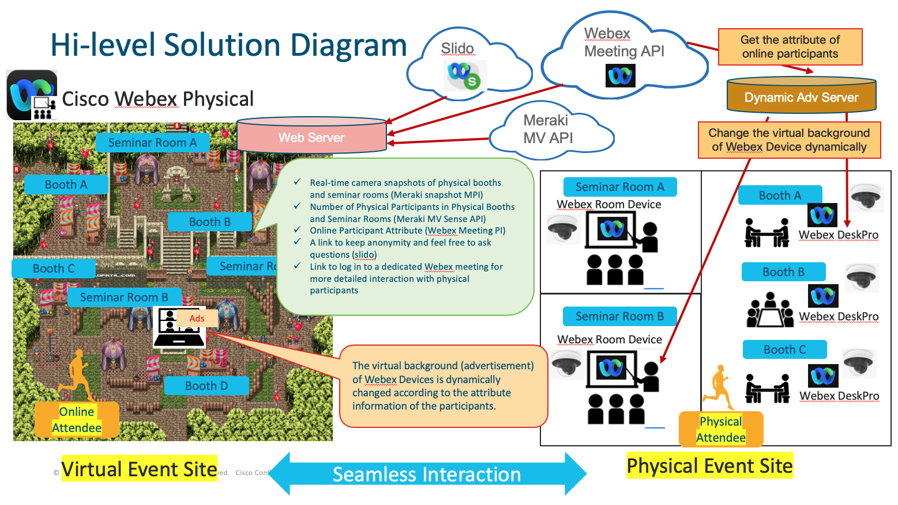

# Cisco Webex Physical

We are proposing Hybrid digital event solution using Cisco Products and API, for post COVID-19 new normal.

* Business Summary

    Using this Webex Physical …
    
    1. Effective dynamic ad display will make more companies want to advertise

    1. Increase event attendance by eliminating barriers between virtual and physical attendees

    1. Online participants can seamlessly participate in physical events

    1. Since the event is expected to attract visitors to the physical corporate exhibit, the number of corporate exhibitors will increase, resulting in an increase in event revenue

    1. Incorporating images felt in the physical venue into the virtual venue（Be primarily a physical venue, not a virtual one.）

    1. Virtual attendees can also interact with the company as they would at a physical event.

    1. Online participants can remain anonymous and get a sense of the physical venue before joining the virtual meeting.

    – Virtual participants can know what is going on in the physical event or corporate exhibition (participant information, local video, questions, etc.) before attending the Webex Meeting (Standing to watch, eavesdropper and anonymity

    – Virtual participants can ask questions and other questions in anonymity before joining Webex Meetings. (Utilizing Slido)

    – If you want to have a more in-depth conversation, you can seamlessly join a Webex conference and interact with the physical participants

* This use case is based on these products:

    * Meraki Camera MV (People Count and External RTSP)

    * Webex Desk Pro (xAPI)

    * Slido

## Use Case Description

* Customer’s challenge

    The hospital is the organizer of the Japan Association for Medical Informatics (JAMI) academic conference to be held this fall and is considering holding a hybrid event.

    Before the pandemic, this academic conference earned income from the exhibition fees and advertising expenses of a company’s physical exhibition booth, but due to the lack of expectation of a large  number of physical visitors, more companies will cancel the exhibition and a new source of income will be needed.

    Hospitals also want a hybrid event that removes the barriers between physical and online participants and allows online participants to attend physical company’s exhibition booth and seminars without hesitation. Hospitals expect that removing this barrier will revitalize the entire event, attract more visitors, increase the number of companies exhibiting at the event, and increase revenue.

* Our Solution

    (1) Dynamic advertising solution

    First, get the attribute information of online participants of company exhibition booths and seminars from the server via Webex Meeting API.

    Next, using the Webex Room Device and DeskPro API used by the speaker, the virtual background (advertisement) is dynamically changed according to the attribute information of the participants. This allows the organizer to effectively advertise to the participants.

    (2) Barrier removal solution for online and physical participants

    Create a virtual event web page for online participants. The corporate booths and seminar rooms displayed on the web page are linked to the actual booths and seminar rooms. When an online participant hovers over a booth or seminar room on a web page, the following information is displayed so that the physical condition of the booth or seminar room can be grasped while maintaining anonymity.

        Real-time camera streamings of physical booths and seminar rooms (Meraki External RTSP)

        The Number of Physical Participants in Physical Booths and Seminar Rooms (Meraki MV Sense API)

        Online Participant Attributes (Webex xAPI)

        A link to keep anonymity and feel free to ask questions (Slido)

        Link to log in to a dedicated Webex meeting for more detailed interaction with physical participants
    
